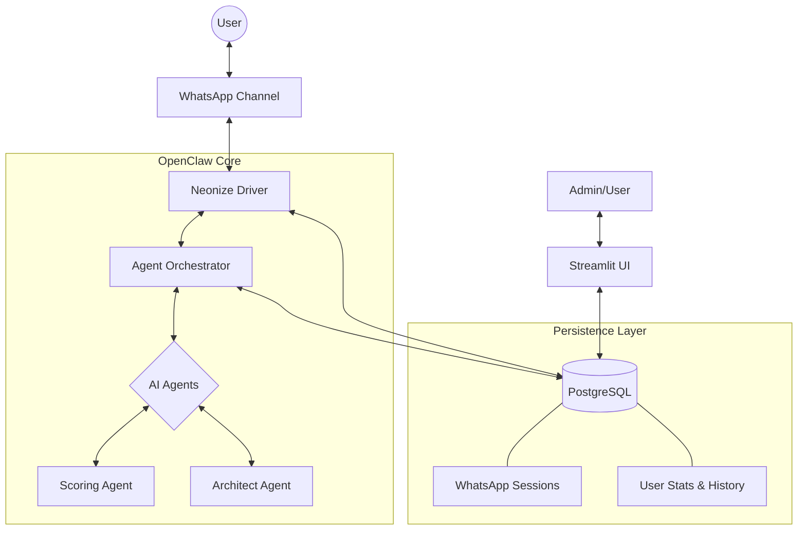

#  OpenClaw: The AI Interview Architect

[](https://github.com/sharmarajeshkr/opwnclaw_whatsapp_daily)
[](https://www.python.org/)
[](https://www.postgresql.org/)
[](#)

**OpenClaw** is a state-of-the-art technical training engine that delivers high-fidelity architectural challenges, coding deep-dives, and real-time tech insights via WhatsApp. Designed for senior engineers, it utilizes a multi-agent orchestration layer to create personalized adaptive learning paths.

---

## 🎨 System Overview

OpenClaw isn't just a bot; it's a **stateless distributed training platform**. By leveraging a centralized PostgreSQL backend, it decouples the communication layer from the session state, allowing for seamless scaling and robust user recovery.

### 🧬 Core Pillars

*   🛡️ **Stateless Authentication**: WhatsApp sessions are stored in Postgres. Restart the backend, scale horizontally, or migrate servers — your pairing remains intact.
*   🧠 **Agentic Intelligence**: Specialized agents for **HLD/LLD Challenge Generation**, **Mastery Scoring**, and **News Synthesis**.
*   📈 **Adaptive Mastery**: The system tracks your performance across sub-topics (Kafka, Microservices, AI) and adjusts the challenge difficulty in real-time.
*   🦞 **Soft-Delete Recovery**: Interactive registration flow that recognizes returning users, restoring their streaks and history instantly.

---

## 📐 Architecture



---

## 🛠️ Technology Stack

| Category | Technology | Purpose |
| :--- | :--- | :--- |
| **Interface** | Streamlit | Administrative Dashboard & Analytics |
| **Messaging** | Neonize / Baileys | High-performance WhatsApp connectivity |
| **Brain** | GPT-4o / DALL-E 3 | Content generation & visual architectures |
| **Database** | PostgreSQL | Centralized state, history, and config |
| **Cache** | Redis | High-speed LLM response caching |
| **Logic** | Pydantic AI | Robust type-safe agent definitions |

---

## ⚙️ Quick Start

### 1. Database Setup
Ensure PostgreSQL is running and initialize the schema:
```bash
psql -U postgres -d openclaw -f db_init/postgres-init.sql
```

### 2. Environment Configuration
Define your `.env` in the root directory:
```env
OPENAI_API_KEY=sk-...
POSTGRES_SERVER=localhost
POSTGRES_DB=openclaw
POSTGRES_USER=postgres
POSTGRES_PASSWORD=your_pass
FERNET_KEY=your_encryption_key
```

### 3. Execution
The system operates in two parts:

| Part | Command | Function |
| :--- | :--- | :--- |
| **Dashboard** | `streamlit run dashboard.py` | Manage users, Pairing QR, and Stats |
| **Worker** | `python main.py` | Handles scheduled delivery & AI agents |

---

## 💡 Troubleshooting

-   **SSL Error (pq)**: If your Postgres server doesn't support SSL, the system auto-appends `?sslmode=disable` to the DSN to ensure connectivity.
-   **FileNotFound (QR)**: Ensure the `data/users` directory exists (the system will attempt to create this automatically on first run).
-   **Pairing Required**: If you see `Logged out` in the logs, go to the Dashboard and click **"Generate My QR Code"** to re-link.

---

## 🛡️ License & Standards
Developed for professional technical training. All rights reserved. Code follows modern **Uncle Bob's Clean Architecture** principles.